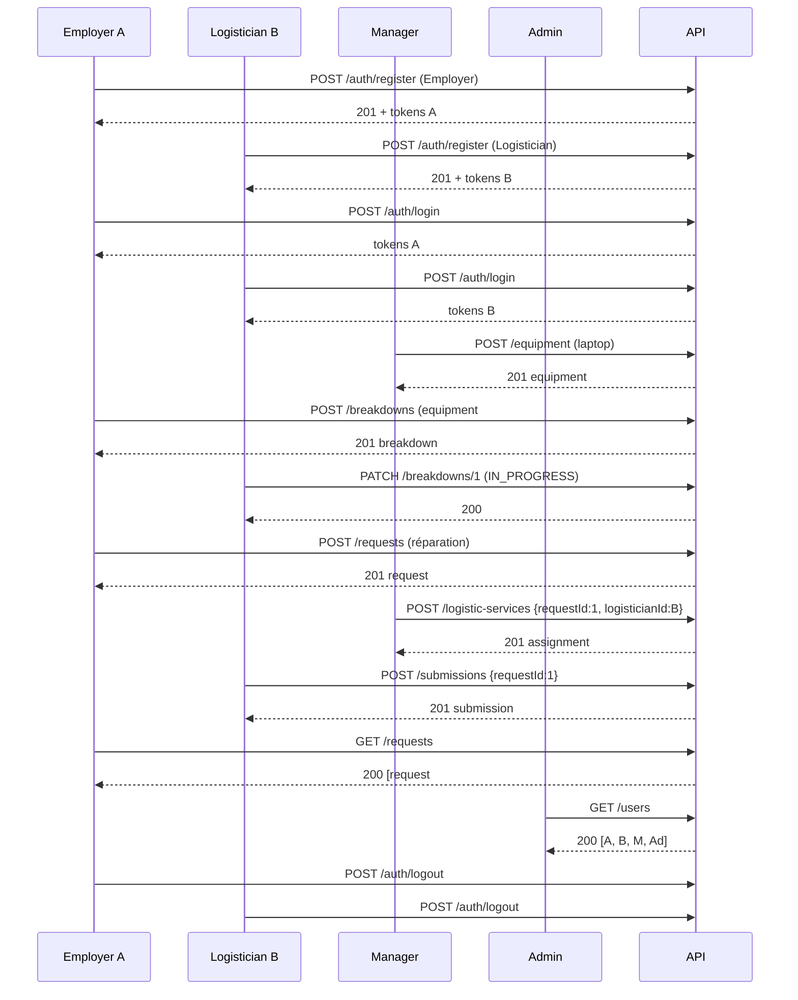

# Plan de Test Complet - RHopenLabs API

**Version :** 1.0  
**Date :** 2026-09-29  
**Base URL :** `http://localhost:4000/api`  
**Swagger UI :** `http://localhost:4000/api-docs`

---

## 1. Prérequis

```bash
# Démarrer le serveur
npm run dev

# Base de données à jour
npm run db:push   # ou db:migrate

# Vérifier Swagger
open http://localhost:4000/api-docs
```

**Collection Postman :** `postman-collection.json` (à la racine du projet)

---

## 2. Variables Postman

| Variable | Valeur | Description |
|----------|--------|-------------|
| `baseUrl` | `http://localhost:4000/api` | URL de base |
| `accessToken` | *(auto)* | Jeton d'accès (mis à jour par Login) |
| `refreshToken` | *(auto)* | Jeton de refresh (mis à jour par Login) |

**Authentification :** Bearer Token `{{accessToken}}` (configuré au niveau collection)

---

## 3. Matrice de Tests

### 3.1 Health & Base

| ID | Test | Méthode | Endpoint | Auth | Critère de succès |
|----|------|---------|----------|------|-------------------|
| T01 | API up | GET | `/health` | ❌ | 200 `{status: "ok"}` |
| T02 | Racine API | GET | `/` | ❌ | 200 `{name: "RHopenLabs API"}` |
| T03 | Swagger UI | GET | `/api-docs` | ❌ | 200 HTML |

---

### 3.2 Auth - Flow Nominal

| ID | Test | Méthode | Endpoint | Body | Auth | Critère de succès |
|----|------|---------|----------|------|------|-------------------|
| A01 | Register Employer | POST | `/auth/register` | `{email, pwd, role: "Employer"}` | ❌ | 201 + tokens |
| A02 | Register Logistician | POST | `/auth/register` | `{email, pwd, role: "Logistician"}` | ❌ | 201 + tokens |
| A03 | Register rôle invalide | POST | `/auth/register` | `{email, pwd, role: "Admin"}` | ❌ | 400 validation |
| A04 | Register email dupliqué | POST | `/auth/register` | même email que A01 | ❌ | 409 conflict |
| A05 | Login valide | POST | `/auth/login` | `{email, pwd}` | ❌ | 200 tokens |
| A06 | Login email inconnu | POST | `/auth/login` | `{email: "x@x.com", pwd}` | ❌ | 401 |
| A07 | Login mauvais pwd | POST | `/auth/login` | `{email, pwd: "wrong"}` | ❌ | 401 |
| A08 | Refresh token valide | POST | `/auth/refresh` | `{refreshToken}` | ❌ | 200 nouveau accessToken |
| A09 | Refresh token expiré | POST | `/auth/refresh` | vieux token (>7j) | ❌ | 401 |
| A10 | Refresh token absent | POST | `/auth/refresh` | `{}` | ❌ | 400 validation |
| A11 | Me avec token | GET | `/auth/me` | - | ✅ | 200 user |
| A12 | Me sans token | GET | `/auth/me` | - | ❌ | 401 |
| A13 | Me token invalide | GET | `/auth/me` | - | `Bearer invalid` | 401 |
| A14 | Logout | POST | `/auth/logout` | - | ✅ | 200 |
| A15 | Change password | PUT | `/auth/password` | `{current, new}` | ✅ | 200 |
| A16 | Change password mauvais current | PUT | `/auth/password` | `{current: "wrong", new}` | ✅ | 401 |
| A17 | Rate limit login (20 req) | POST x21 | `/auth/login` | - | ❌ | 429 après 20 |

---

### 3.3 Users - RBAC (Admin/Director only)

| ID | Test | Rôle token | Méthode | Endpoint | Critère de succès |
|----|------|------------|---------|----------|-------------------|
| U01 | Liste users (Admin) | Admin | GET | `/users` | 200 paginé |
| U02 | Liste users (Employer) | Employer | GET | `/users` | 403 forbidden |
| U03 | Créer user (Admin) | Admin | POST | `/users` | 201 créé |
| U04 | Créer user (Director) | Director | POST | `/users` | 201 créé |
| U05 | Créer user (Manager) | Manager | POST | `/users` | 403 |
| U06 | Get user self | Employer | GET | `/users/:id` | 200 son user |
| U07 | Get user autre | Employer | GET | `/users/:id` | 403/404 |
| U08 | Update user (Admin) | Admin | PATCH | `/users/:id` | 200 maj |
| U09 | Delete user (Admin) | Admin | DELETE | `/users/:id` | 200 |
| U10 | Delete user (Director) | Director | DELETE | `/users/:id` | 403 |

---

### 3.4 Equipment - RBAC

| ID | Test | Rôle | Méthode | Endpoint | Body/Query | Critère de succès |
|----|------|------|---------|----------|------------|-------------------|
| E01 | Liste equipment | Employer | GET | `/equipment` | `?status=AVAILABLE` | 200 filtré |
| E02 | Créer equipment (Manager) | Manager | POST | `/equipment` | `{name, type, serialNumber, status}` | 201 |
| E03 | Créer equipment (Employer) | Employer | POST | `/equipment` | - | 403 |
| E04 | Validation manquante | Manager | POST | `/equipment` | `{name: "test"}` | 400 |
| E05 | Serial dupliqué | Manager | POST | `/equipment` | même serial | 409 |
| E06 | Get by ID | Employer | GET | `/equipment/:id` | - | 200 |
| E07 | Update equipment (Manager) | Manager | PATCH | `/equipment/:id` | `{status: "MAINTENANCE"}` | 200 |
| E08 | Delete equipment (Manager) | Manager | DELETE | `/equipment/:id` | - | 200 |

**Status valides :** `AVAILABLE`, `ASSIGNED`, `MAINTENANCE`, `RETIRED`

---

### 3.5 Breakdowns - RBAC

| ID | Test | Rôle | Méthode | Endpoint | Body/Query | Critère de succès |
|----|------|------|---------|----------|------------|-------------------|
| B01 | Liste breakdowns | Employer | GET | `/breakdowns` | `?status=OPEN` | 200 filtré |
| B02 | Créer breakdown | Employer | POST | `/breakdowns` | `{equipmentId, description, severity}` | 201 |
| B03 | Validation manquante | Employer | POST | `/breakdowns` | `{description: "test"}` | 400 |
| B03b | Get by ID | Employer | GET | `/breakdowns/:id` | - | 200 |
| B04 | Update status (Logistician) | Logistician | PATCH | `/breakdowns/:id` | `{status: "IN_PROGRESS"}` | 200 |
| B05 | Update status (Employer) | Employer | PATCH | `/breakdowns/:id` | - | 403 |
| B06 | Delete (Manager) | Manager | DELETE | `/breakdowns/:id` | - | 200 |
| B07 | Delete (Logistician) | Logistician | DELETE | `/breakdowns/:id` | - | 403 |

**Status valides :** `OPEN`, `IN_PROGRESS`, `RESOLVED`, `CLOSED`

---

### 3.6 Requests - Isolation par User

| ID | Test | Rôle | Méthode | Endpoint | Critère de succès |
|----|------|------|---------|----------|-------------------|
| R01 | Liste requests (Employer) | Employer | GET | `/requests` | 200 **ses propres** |
| R02 | Liste requests (Admin) | Admin | GET | `/requests` | 200 **toutes** |
| R03 | Créer request | Employer | POST | `/requests` | 201 (owner = lui) |
| R04 | Get own request | Employer | GET | `/requests/:id` | 200 |
| R05 | Get autre request | Employer | GET | `/requests/:id` | 404 |
| R06 | Get any request (Admin) | Admin | GET | `/requests/:id` | 200 |
| R07 | Update own request | Employer | PATCH | `/requests/:id` | 200 |
| R08 | Delete request (Manager) | Manager | DELETE | `/requests/:id` | 200 |

---

### 3.7 Logistic Services - RBAC Manager+

| ID | Test | Rôle | Méthode | Endpoint | Body | Critère de succès |
|----|------|------|---------|----------|------|-------------------|
| L01 | Liste affectations | Employer | GET | `/logistic-services` | - | 200 |
| L02 | Créer affectation | Manager | POST | `/logistic-services` | `{requestId, logisticianId}` | 201 |
| L03 | Affectation doublon | Manager | POST | `/logistic-services` | même requestId | 409 |
| L04 | Get by ID | Employer | GET | `/logistic-services/:id` | - | 200 |
| L05 | Delete (Manager) | Manager | DELETE | `/logistic-services/:id` | - | 200 |

---

### 3.8 Submissions - Isolation par User

| ID | Test | Rôle | Méthode | Endpoint | Body | Critère de succès |
|----|------|------|---------|----------|------|-------------------|
| S01 | Liste submissions (Employer) | Employer | GET | `/submissions` | - | 200 **ses propres** |
| S02 | Liste submissions (Admin) | Admin | GET | `/submissions` | - | 200 toutes |
| S03 | Créer submission | Employer | POST | `/submissions` | `{requestId}` | 201 (user = lui) |
| S04 | Submission doublon | Employer | POST | `/submissions` | même requestId | 409 |
| S05 | Get own submission | Employer | GET | `/submissions/:idRequest/:idUser` | - | 200 |
| S06 | Get autre submission | Employer | GET | `/submissions/:idRequest/:idUser` | - | 404 |
| S07 | Delete (Manager) | Manager | DELETE | `/submissions/:idRequest/:idUser` | - | 200 |

---

### 3.9 Validation & Edge Cases

| ID | Test | Endpoint | Critère de succès |
|----|------|----------|-------------------|
| V01 | Body manquant | POST /auth/login | 400 validation |
| V02 | Email invalide | POST /auth/register | 400 |
| V03 | Password < 8 chars | POST /auth/register | 400 |
| V04 | Pagination page=0 | GET /users?page=0 | 400 ou page=1 |
| V05 | Pagination limit=200 | GET /users?limit=200 | 400 max 100 |
| V06 | ID invalide (string) | GET /users/abc | 400 validation |
| V07 | ID inexistant | GET /users/99999 | 404 |
| V08 | Route inconnue | POST /api/inconnu | 404 `ROUTE_NOT_FOUND` |
| V09 | Méthode non supportée | PUT /health | 404 |

---

### 3.10 Sécurité

| ID | Test | Critère de succès |
|----|------|-------------------|
| SEC01 | Helmet headers | `X-Content-Type-Options: nosniff`, `X-Frame-Options`, `Referrer-Policy`, etc. |
| SEC02 | CORS autorisée | `Origin: http://localhost:5173` → 200 + `Access-Control-Allow-Origin` |
| SEC03 | CORS non autorisée | `Origin: http://evil.com` → pas de header CORS ou 403 |
| SEC04 | X-Powered-By absent | Header absent |
| SEC05 | Body > 100kb | POST gros JSON → 413 |

---

## 4. Scénario E2E Complet (Démo Jury)



**Résultat attendu :** Tous les endpoints répondent avec les codes HTTP et structures de données corrects.

---

## 5. Checklist Pré-Démo

- [ ] `npm run dev` → `API demarree sur http://localhost:4000`
- [ ] `npm run db:push` ou `db:migrate` → DB synchronisée
- [ ] Swagger accessible sur `http://localhost:4000/api-docs`
- [ ] Collection Postman importée (`postman-collection.json`)
- [ ] Variable `baseUrl` = `http://localhost:4000/api`
- [ ] Seed données : au moins 1 Admin, 1 Director, 1 Manager, 1 Employer, 1 Logistician
- [ ] Tokens se mettent à jour auto après Login (voir onglet **Tests** dans Postman)

---

## 6. Export pour le Jury

1. **Postman :** `File > Export > Collection v2.1` → `RHopenLabs_API_Tests.json`
2. **Environnement :** `File > Export > Environment` → `RHopenLabs_Env.json`
3. **Ce document :** `TEST_PLAN.md` (ce fichier)
4. **Swagger JSON :** `GET http://localhost:4000/api-docs/json` → sauvegarder

---

## 7. Commandes Utiles

```bash
# Logs serveur
npm run dev

# Reset DB complète
npm run db:reset

# Seed données de test
npm run db:seed

# Lint + Typecheck
npm run lint && npm run typecheck

# Build production
npm run build && npm start
```

---

*Document généré automatiquement pour la soutenance RHopenLabs.*